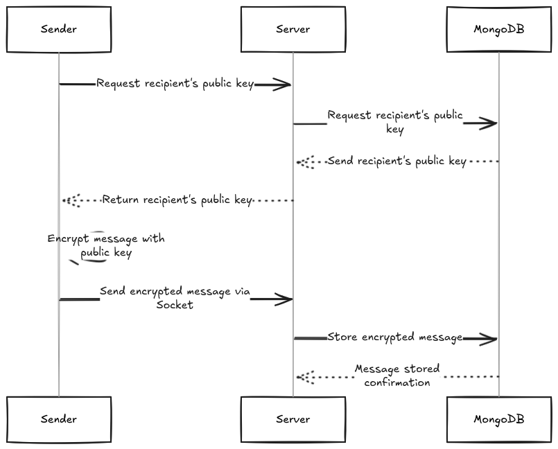
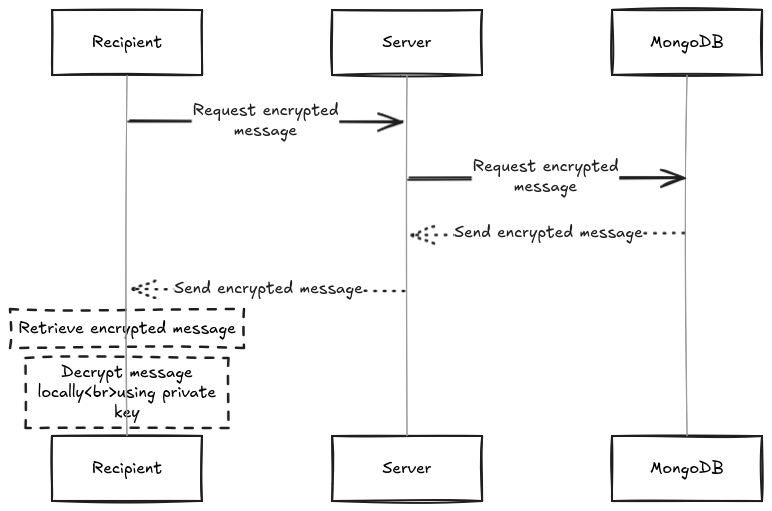
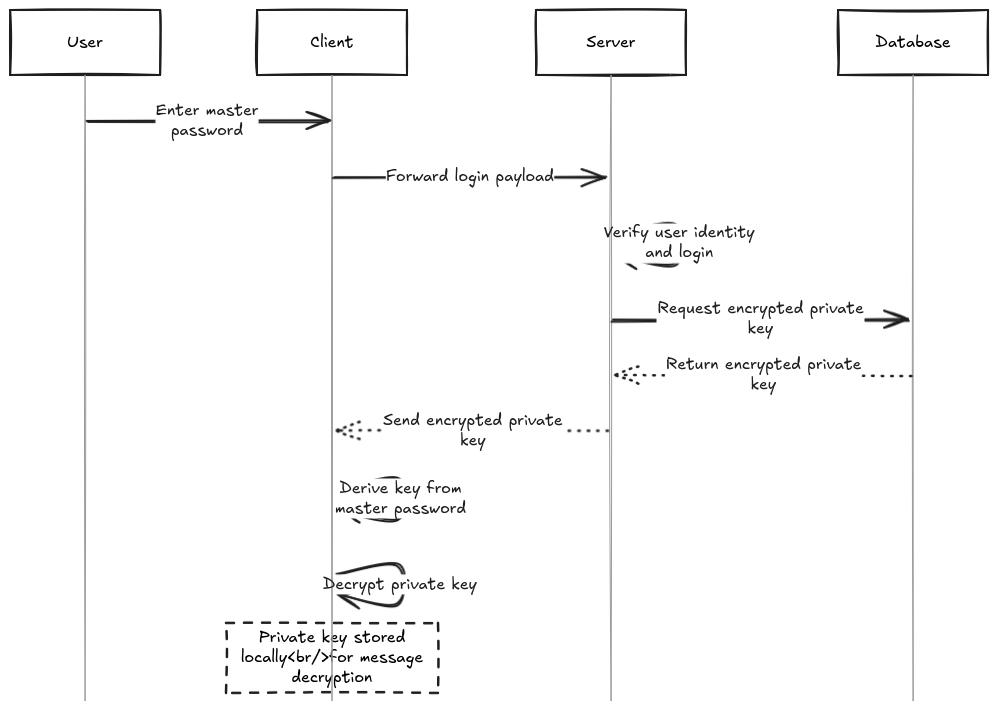

# Encrypted Chat Application Design and Workflow

## Table of Contents

1. [System Architecture](#system-architecture)
   - [Client](#1-client)
   - [Server](#2-server)
   - [Database](#3-database)
2. [Workflows](#workflows)
   - [User Registration](#user-registration)
   - [Sending a Message](#sending-a-message)
   - [Receiving a Message](#receiving-a-message)
   - [Multi-Device Support Workflow](#multi-device-support-workflow)
3. [Vulnerabilities & Security Considerations](#vulnerabilities--security-considerations)
   - [Potential Vulnerabilities](#potential-vulnerabilities)
   - [Potential Improvements](#potential-improvements)
4. [Conclusion](#conclusion)

---

## System Architecture

### 1. **Client**

- Generates and manages **RSA key pairs** for encryption and decryption.
- Handles **user authentication and session tokens**.
- Encrypts messages using the recipient’s **public key** before sending them.

### 2. **Server**

- Acts as a **relay** for encrypted messages.
- Stores and retrieves **public/private keys** and **encrypted messages** from the database.
- Facilitates secure key exchange between users.

### 3. **Database**

- Stores **encrypted private keys** for retrieval, allowing multi-device access.
- Stores **encrypted messages** to ensure privacy.
- Uses **encryption at rest** and access control mechanisms.

---

## Workflows

### **User Registration**

1. The user **generates an RSA key pair** locally.
2. The public key is sent to the server.
3. The **private key is encrypted with the master password** and uploaded to the server for recovery.

### **Sending a Message**

1. The sender requests the recipient’s **public key** from the server.
2. The server sends a request to MongoDB to retrieve the recipient's public key.
3. MongoDB sends the recipient's public key.
4. The server returns the recipient's public key to the sender.
5. The sender **encrypts the message** using the recipient’s **public key**.
6. The encrypted message is sent to the server **via a Socket connection**.
7. The server sends the encrypted message to the MongoDB database.
8. MongoDB **stores the encrypted message** in the database.

### **Receiving a Message**

1. The recipient requests the **encrypted message** from the server.
2. The server requests the encrypted message from the MongoDB database.
3. MongoDB sends the encrypted message to the server.
4. The server sends the encrypted message to the recipient.
5. The recipient **retrieves the encrypted message** from the server.
6. The recipient **decrypts the message locally** using their private key.

### **Multi-Device Support Workflow**

1. The user logs in with their **master password**.
2. The client forwards the payload to the server for verification.
3. The server verifies the user’s identity and login.
4. The server requests the **encrypted private key** from the MongoDB database.
5. The server sends the encrypted private key to the user.
6. The derived key decrypts the user’s **encrypted private key**, restoring access to the private key.
7. The user’s **private key is decrypted** and stored locally for message decryption.

---

## Vulnerabilities & Security Considerations

### **Potential Vulnerabilities**

- **Replay Attacks**: Without session expiration, old encrypted messages could be replayed to trick the recipient.

- **Password Recovery**: Storing encrypted private keys for password recovery poses a security risk if the master password is compromised.

### **Potential Improvements**

1. **Perfect Forward Secrecy (PFS)**:
   - Implementing the **Signal Protocol** would ensure past messages remain secure even if encryption keys are compromised.
2. **Zero-Knowledge Proof Authentication**:
   - Ensuring that authentication is done without exposing the password to the server.

---

## Conclusion

This project provides a **secure and privacy-focused** messaging solution that ensures **end-to-end encryption** while allowing users to communicate safely without storing any metadata. Future improvements will focus on enhancing security, usability, adding the TOR relay network for IP anonymity, and password recovery support.