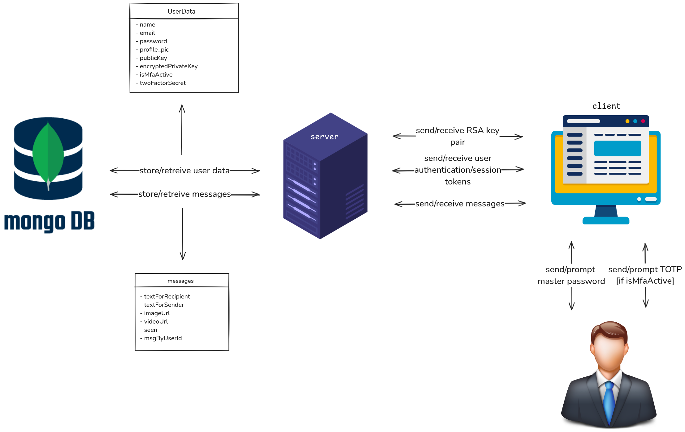
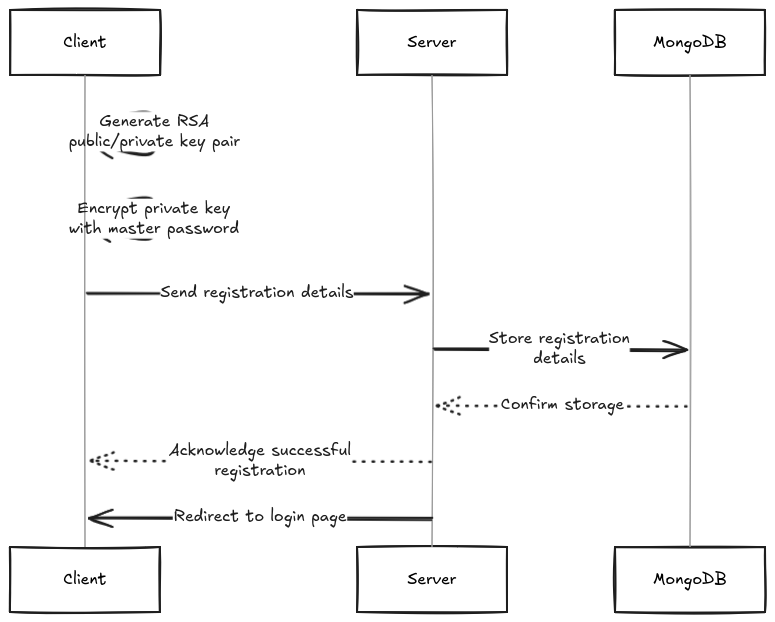
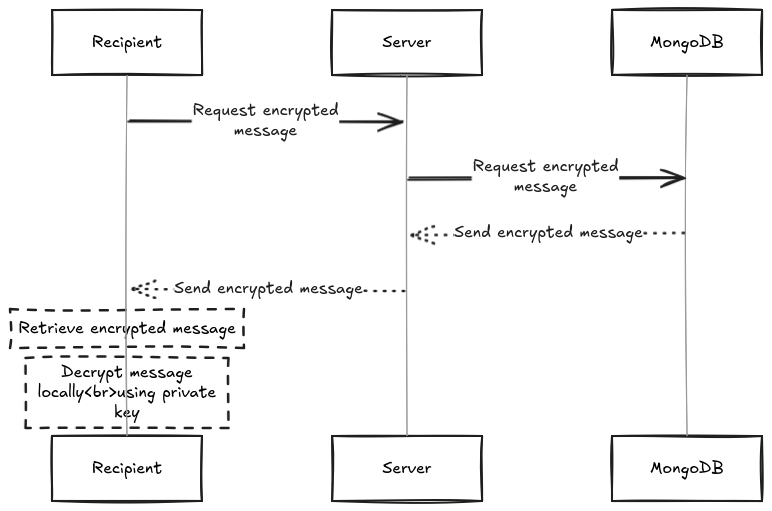

\begin{abstract}
\textit{
    Chat applications have become integral to modern communication, offering users the ability to exchange messages, images, and files free of cost. However, ensuring the security and privacy of these messages remains a challenge. This paper proposes a secure chat application with end-to-end encryption, ensuring private information exchange without third-party access. We outline the necessary security requirements, design principles, and compare our solution with popular chat applications. Additionally, security and performance evaluations validate the effectiveness of our proposed system.
}
\end{abstract}

---

## 1. Introduction

With the rapid proliferation of smartphones, chat applications have become an essential part of digital communication. These applications provide real-time messaging services, including text, multimedia exchange, and file sharing, with cross-platform support for Android and iOS.

Existing chat applications primarily rely on two architectures: client-server and peer-to-peer networks. Client-server models store messages on centralized servers, which can be vulnerable to attacks, while peer-to-peer models eliminate a central authority but present challenges in synchronization and security.

Security and privacy in chat applications are paramount. However, studies by the Electronic Frontier Foundation (EFF) indicate that most messaging platforms fail to meet security standards. Many applications use Transport Layer Security (TLS) for communication, but service providers retain access to messages. This introduces vulnerabilities that adversaries can exploit.

### Contributions

This paper presents a novel secure chat application with the following features:

1. A **client-server architecture** supporting **real-time communication** with user presence status.
2. **End-to-end encryption** ensuring only sender and receiver can access messages.
3. **Secure local storage** through automatic message and key deletion after session termination.
4. Enhanced security features such as **multi-factor authentication** (MFA).
5. **Multi-device support** to enable message synchronization securely.
6. Performance and security testing to validate our approach.

---

## 2. Overview of Existing Chat Applications

We examine the security implementations of widely-used messaging applications and identify their limitations.

### 2.1 Viber

Viber is a VoIP and instant messaging application that introduced end-to-end encryption in version 6.0 for Android, iOS, and desktop platforms. ([viber.com](https://www.viber.com/app/uploads/viber-encryption-overview.pdf)) However, concerns have been raised regarding the security of message backups. Specifically, if users opt to back up their message history to cloud services like Google Drive, these backups may not be encrypted, potentially exposing message content. ([reddit.com](https://www.reddit.com/r/viber/comments/ke8p2c/there_is_one_small_issue_with_end_to_end/)) Additionally, Viber is not open-source, making security audits challenging.

### 2.2 WhatsApp

WhatsApp, with over a billion users, employs end-to-end encryption using the Signal Protocol. ([signal.org](https://signal.org/blog/whatsapp-complete/)) However, since the application is closed-source, independent verification of its implementation is difficult. Metadata collection and server-side storage practices also pose risks to user privacy.

### 2.3 Telegram

Telegram offers both cloud-based and secret chat modes. Regular chats are not end-to-end encrypted, storing messages on centralized servers. Secret chats, on the other hand, provide end-to-end encryption but are device-specific, restricting access across multiple devices. Telegram uses a proprietary cryptographic protocol called MTProto. While MTProto 2.0 has undergone formal verification, ([arxiv.org](https://arxiv.org/abs/2012.03141)) some security researchers have criticized earlier versions for potential vulnerabilities. ([cryptovillage.org](https://cryptovillage.org/security-analysis-of-the-telegram-im/)) Moreover, reliance on SMS-based authentication introduces risks due to SS7 protocol vulnerabilities.

---

## 3. Proposed Architecture

### 3.1 Security Requirements

A secure chat application should meet the following criteria:

- **(R1)** Passwords stored on the server must be encrypted.
- **(R2)** Secure session establishment using unique session keys.
- **(R3)** End-to-end message encryption.
- **(R4)** Encrypted local storage for message retention.
- **(R5)** Restriction on message exchange between unverified users.
- **(R6)** Metadata storage.

### 3.2 System Architecture

Our proposed architecture follows a client-server model with the following workflow:

- **User Registration & Authentication:** Secure user authentication through password hashing and MFA.
- **Message Transmission:** Messages are encrypted using the recipient's public key, 
which is generated by RSA 2048 bit uppon the user's registration.
- **Local Storage Protection:** Encrypted message storage with automatic deletion post-session.
- **Session Management:** Real time session establishment using socket connections. 

### 3.3 Server-Side Implementation

The server utilizes **Node.js** with a **MongoDB** backend. 
Key security features include:

- Middleware for user authentication and session management.
- Secure session management through Express.js.
- Data processing using JSON structures.
- Real-time messaging with Socket.io.
- Bcrypt.js for password hashing.
- Acts as a **relay** for encrypted messages.
- Stores and retrieves **public/private keys** and **encrypted messages** from the database.
- Facilitates key exchange between users

Workflow steps:

1. Establish a MongoDB connection and start the Node.js server.
2. Client requests are received via HTTP in JSON format.
3. Requests are routed through Express.js for validation.
4. Queries are processed by MongoDB, returning encrypted responses.

### 3.4 Client-Side Implementation

The client-side application is built using **React.js** with **Redux** for state management. Key features include:

- User interface for sending/receiving messages.
- Generates and manages **RSA key pairs** for encryption and decryption.
- Handles **user authentication and session tokens**.
- Encrypts messages using the recipient’s **public key** before sending them.

### 3.4.1 User Registration

1. The user **generates an RSA key pair** locally.
2. The public key is sent to the server.
3. The **private key is encrypted with the master password** and uploaded to the server for recovery.

### 3.4.2 User Login/Multi-Device 

1. The user logs in with their **master password**.
2. The client forwards the payload to the server for verification.
3. The server verifies the user’s identity and login.
4. The server requests the **encrypted private key** from the MongoDB database.
5. The server sends the encrypted private key to the user.
6. The derived key decrypts the user’s **encrypted private key**, restoring access to the private key.
7. The user’s **private key is decrypted** and stored locally for message decryption.
[If isMfaActive] 
8. The server requests TOTP to the client.
9. The client forwards the request to the user.
10. The user sends the TOTP to the client.
11. The client forwards TOTP to the server for verification.
12. The server sends the user's token to the middleware for authentication.
13. The middleware verifies the user's authenticity.
14. The server requests the twoFactorSecret to the database.
15. The database returns the twoFactorSecret to the server.
16. The server verifies the user's twoFactorSecret and TOTP.

### 3.5 Message Transmission

#### 3.5.1 Sending a Message

1. The sender requests the recipient’s **public key** from the server.
2. The server sends a request to MongoDB to retrieve the recipient's public key.
3. MongoDB sends the recipient's public key.
4. The server returns the recipient's public key to the sender.
5. The sender **encrypts the message** using the recipient’s **public key**.
6. The encrypted message is sent to the server **via a Socket connection**.
7. The server sends the encrypted message to the MongoDB database.
8. MongoDB **stores the encrypted message** in the database.

#### 3.5.2 Receiving a Message

1. The recipient requests the **encrypted message** from the server.
2. The server requests the encrypted message from the MongoDB database.
3. MongoDB sends the encrypted message to the server.
4. The server sends the encrypted message to the recipient.
5. The recipient **retrieves the encrypted message** from the server.
6. The recipient **decrypts the message locally** using their private key.

### 3.6 MultiFactor Authentication (MFA)

#### 3.6.1 Enabling MFA

0. The client requests 2FA enabling to the server, sendind the user's token.
1. The server forwards the user's token to the middleware for authentication.
2. The middleware verifies the user's authenticity.
3. The server generates twoFactorSecret and qrCode.
4. The server sends qrCode to the client for verification.
5. The client forwards the qrCode to the user to be scanned.
6. The user sends the TOTP code to the client.
7. The client forwards the TOTP code and twoFactorSecret to the server.
8. The server forwards the user's token to the middleware for authentication.
9. The middleware verifies the user's authenticity.
10. The sever verifies the user's MFA credentials.
11. The server sends the twoFactorSecret to the database.
12. The database stores the twoFactoSecret.

#### 3.6.2 Disabling MFA

0. The client requests 2FA disabling to the server, sending the user's token.
1. The server forwards the user's token to the middleware for authentication.
2. The middleware verifies the user's authenticity.
3. The server sends a request to reset the user's twoFactorSecret and isMfaActive to the database.
4. The database resets the twoFactorSecret and isMfaActive.

---

## 4. Security Analysis

We compare our proposed chat application against existing solutions based on security requirements.

| Requirement                  | Proposed Chat | Viber | WhatsApp | Telegram |
|------------------------------|---------------|-------|----------|----------|
| (R1) Password encryption     | Yes           | Yes    | Yes       | Yes       |
| (R2) Secure session keys     | No           | Yes   | Yes      | Yes      |
| (R3) End-to-end encryption   | Yes           | Yes   | No      | Partial  |
| (R4) Encrypted local storage | Yes           | No    | No       | No       |
| (R5) Restricted message exchange | No       | Yes   | Yes      | Yes      |
| (R6) Storing metadata        | No            | Yes   | Yes      | Yes      |

**Table 1:** Comparison of Proposed Chat with Popular Applications

**Notes:**

- **(R3) End-to-end encryption:** Telegram offers end-to-end encryption only in its "Secret Chats" feature; regular chats are not end-to-end encrypted. ([en.wikipedia.org](https://en.wikipedia.org/wiki/Telegram_%28software%29))

- **(R6) Storing metadata:** Viber, WhatsApp, and Telegram collect and store metadata such as user contact information, message timestamps, and IP addresses. ([malwarebytes.com](https://www.malwarebytes.com/blog/news/2021/12/heres-what-data-the-fbi-can-get-from-whatsapp-imessage-signal-telegram-and-more))

The proposed system achieves greater security by implementing password encryption, end-to-end encryption across all chats, encrypted local storage, and by not storing user metadata. 

---

## 5. Conclusion

This paper presents a secure chat application designed to preserve user privacy through end-to-end encryption, secure local storage, and robust authentication mechanisms. Our system mitigates common vulnerabilities observed in existing applications, offering enhanced security features such as multi-factor authentication and secure session keys. Performance testing confirms the feasibility and effectiveness of the proposed solution.

Future work includes expanding security protocols, improving usability, and integrating blockchain-based identity verification to enhance authentication mechanisms.

---